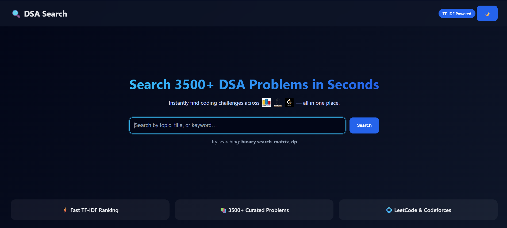
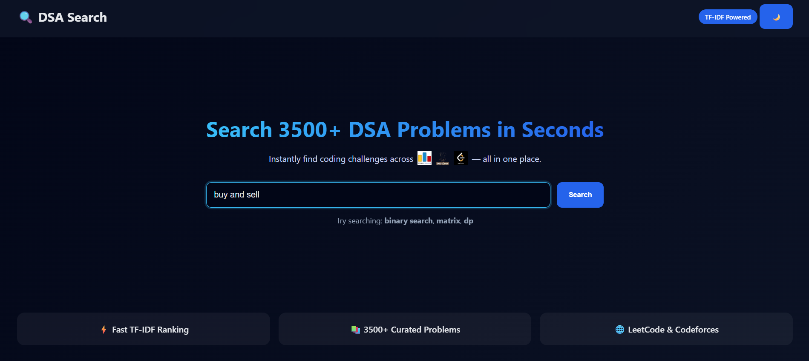
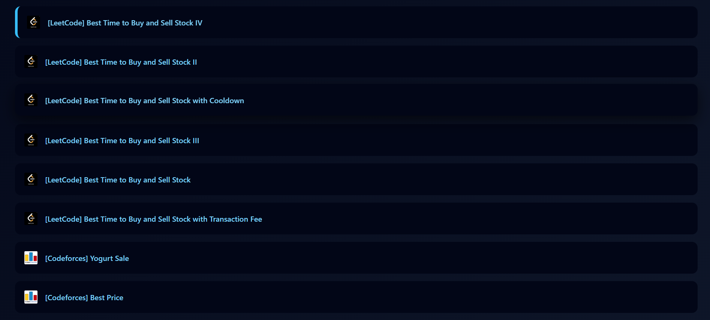

# 🔍 DSA Search Engine

🚀 **Live Demo:**  
👉 https://dsa-search-engine-yzpt.onrender.com/

A fast, intelligent search engine to discover **Data Structures & Algorithms (DSA) problems** across multiple competitive programming platforms — ranked by **semantic relevance**, not just keywords.

---

## 🚀 Overview

The **DSA Search Engine** is a full-stack web application designed to help students and interview candidates quickly find the **most relevant DSA problems** without manually browsing multiple platforms.

Unlike traditional keyword-based search, this project uses **TF–IDF (Term Frequency–Inverse Document Frequency)** and **cosine similarity** to rank problems based on **meaning and context**, resulting in more accurate and useful search results for interview preparation.

---

## ✨ Key Features

- 🔎 Search across **3500+ curated DSA problems**
- ⚡ Fast and accurate **TF–IDF–based semantic ranking**
- 🌐 Aggregates problems from **LeetCode** and **Codeforces**
- 🧠 NLP-based preprocessing for improved relevance
- 🎨 Clean, responsive UI with **Dark / Light mode**
- 📜 Smooth animated scroll to results
- 🔗 Direct links to original problem statements

---

## 🎯 Use Cases

- 📌 Technical interview preparation  
- 📌 Topic-wise DSA practice (arrays, DP, graphs, etc.)  
- 📌 Competitive programming problem discovery  
- 📌 Academic coursework and self-learning  

---

## 🛠️ Tech Stack

### Frontend
- HTML
- CSS
- JavaScript

### Backend
- Node.js
- Express.js

### Search & NLP
- `natural` (TF–IDF implementation)
- `stopword`
- Custom text preprocessing pipeline

### Data Collection
- Puppeteer (used to scrape and build the problem corpus)

---

## 🌐 Deployment

The application is deployed as a **single full-stack Node.js service** on **Render**, serving both frontend and backend from one origin to ensure a reliable, frictionless demo experience.

🔗 **Live URL:** https://dsa-search-engine-yzpt.onrender.com/

> ⚠️ Note: The first request may take a few seconds due to cold start on Render’s free tier.

---

## 📸 Screenshots

### 🏠 Home Page (Dark Mode)


### 🔍 Search in Action


### 📋 Ranked Results


---

## 🧠 How It Works

1. **Data Collection**
   - DSA problems are scraped from platforms like LeetCode and Codeforces.
   - Titles, descriptions, and metadata are extracted into a structured corpus.

2. **Text Preprocessing**
   - Cleaning, tokenization, normalization, and stopword removal.

3. **Indexing**
   - TF–IDF vectors are generated for every problem.
   - Document vectors are normalized to support cosine similarity.

4. **Query Processing**
   - User queries undergo the same preprocessing pipeline.
   - A query vector is generated and compared against all documents.

5. **Ranking**
   - Problems are ranked by cosine similarity score.
   - Top relevant results are returned with platform tags and links.

---

## 📁 Project Structure

```text
DSA-Search-Engine/
├── assets/            # Platform logos & static assets
│   └── screenshots/   # UI screenshots
├── corpus/            # Scraped problem dataset (JSON)
├── utils/             # NLP preprocessing utilities
├── index.html         # Frontend markup
├── styles.css         # Styling (Dark/Light mode)
├── script.js          # Frontend logic
├── index.js           # Backend server (Express + TF-IDF)
├── package.json
└── README.md
```
---
## ▶️ Getting Started

### Clone the repository
bash
git clone https://github.com/harshtadas8/DSA-Search-Engine.git

### Install Dependencies
bash
npm install

### Start the Server
bash
node index.js

### Open in Browser
bash
http://localhost:3000

---
Made with ❤️ for DSA practice and learning.
